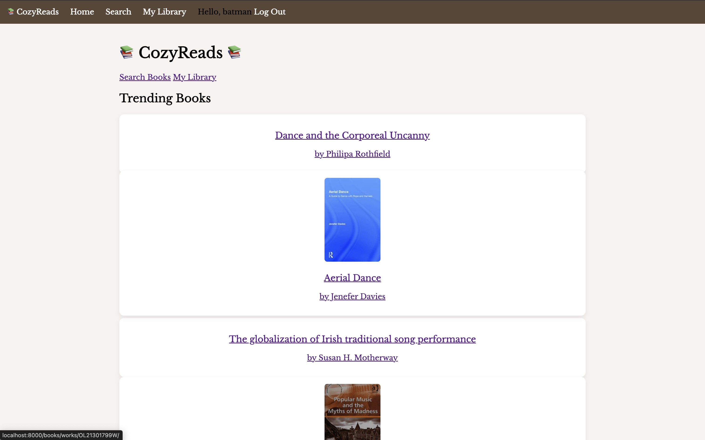

# CozyReads

## Screenshot

## Link
[Live App](https://cozyreads-app-efa74b518c34.herokuapp.com/)

### Details:
Hi all! Welcome to my book tracking app. I was inspired to make this for my partner who is getting into reading multiple books. Here you can search for a large amount of books provided by an Open Library API. You can create an account to be able to create your lists as well as leave notes and ratings for the books you read.

### Attributions:
* General Assembly Class Notes
* [Open Library API](https://openlibrary.org/)
* [Google](https://www.google.com/)
* [YouTube](https://www.youtube.com/)
* [W3Schools](https://www.w3schools.com/python/python_intro.asp)
* Logo created by chatGPT

#### Technologies Used:
* HTML
* CSS
* Python
* Django
* Heroku

#### Next Steps:
+ Add a progress bar to help users know where they left off in a book
+ Improve the GUI so it does not look plain
+ Add a check for book details to see if the book has a movie adaptation
+ Limit amount of genres that can be visible to user
+ Improve on the display for the lists in My Library
+ Add a community page so users can see what other users are reading 
+ Change notes section so that users can post multiple comments 
